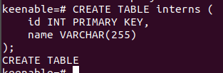
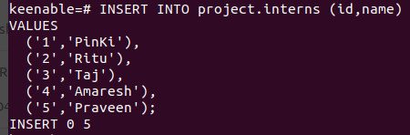
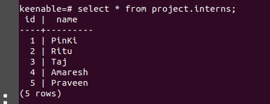

# PostgreSQL
[Introduction](#introduction)

[Database](#database)

[Rdbms](#rdbms)

[Acid properties](#acid-properties)

[Primary and foreign key](#primary-key-and-foreign-key)

[PostgreSQL crud operation](#postgresql-crud-operations)

[Schema](#schema)

[Data types](#data-types)

[DDL, DCL, DML abbreviations](#ddl-dcl-and-dml)

[Installation of postgresql](#installation-of-postgressql-on-container)


### INTRODUCTION
PostgreSQL is a free and open-source relational database management system. It is a powerful tool for storing and managing data and it is used by instagram,netflix etc.

### DATABASE 
In context postgresql, A database is a structured collection of data. It is a way of organizing and storing data so that it can be easily accessed and managed.


### RDBMS
Relational Database Management System. It is the software used to store, manage, query and retrieve data stored in relational databases.

### ACID PROPERTIES
Atomicity, Consistency, Isolation and Durability.

**Atomicity-**  Each transaction is "all or nothing".

Example- transferring money is successfully from one account to another account, or the entire transfer is cancelled if anything goes wrong along the way.

**Consistency-** Data should be valid according to all defined rules.

Example- Every user must have a unique email address, and this rule is always followed.

**Isolation-** Transactions do not affect each other.

Example- In a database, multiple users update their profiles at same time , but do not affect each other.

**Durability-** Committed data would not be lost, even after power failure.

Example: It is like a google document in our system. Even if our system crashes or is not working properly our document will be saved. And when we restart our system document is still there.

### Primary key and Foreign key
In simple words, a primary key is a unique identifier for each row in a table, while a foreign key is a column that references the primary key of another table.

### PostgreSQL CRUD operations

PostgreSQL supports the following CRUD operations:

- **Create:** Inserts a new row into a table.
  
- **Read:** Retrieves data from a table.

- **Update:** Modifies existing data in a table.
  
- **Delete:** Removes rows from a table.


### SCHEMA
Schema is a collection of tables and whithout schema we can't define the data types in a table.


### DATA TYPES
Data types are a way to limit the kind of data that can be stored in a table.
- Data type of a column defines what value the column can store in table.
- Defined while creating tables in database.
Here are some commonly used data types in PostgreSQL:
- **INT-** An integer data type stores a whole number.
- **VARCHAR-** A varchar data type stores a variable-length string of up to 255 characters.
- **DATE-**  It is used to store date values in a database. 
- **SERIAL-** A serial data type is a unique identifier that is automatically generated when a new record is inserted into a table.

### DDL, DCL, and DML 
These are abbreviations that stand for different categories of SQL (Structured Query Language) commands used in relational database management systems like PostgreSQL.

PostgreSQL DDL, DCL, and DML statements

PostgreSQL uses the following types of SQL statements to manage and manipulate data:

- DDL (Data Definition Language): DDL statements are used to create, modify, and drop database objects such as tables, schemas, and databases.
- DCL (Data Control Language): DCL statements are used to grant and revoke user privileges and permissions.
- DML (Data Manipulation Language): DML statements are used to insert, update, delete, and select data.
  
#### Installation of postgresSQL on container

To install PostgreSQL on a container using Podman, you can run the following command:

```
podman run --name postgres -e POSTGRES_USER=ritu -e POSTGRES_PASSWORD=ritu -d -p 5432:5432 postgres
```
This will create a new container named postgres and start the PostgreSQL database server. 

Now you can create new database, schema, tables.
By the following query:

CREATE DATABASE ____;__


CREATE SCHEMA ____;


CREATE TABLE ___;



Now insert the value in created table.



Here you can read the data by following this query:




